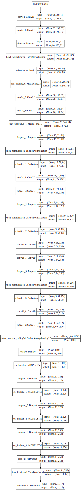
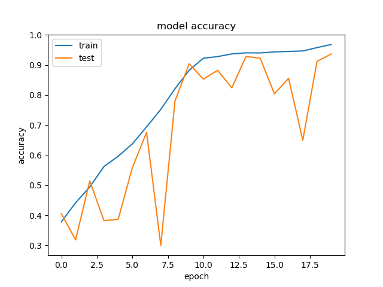
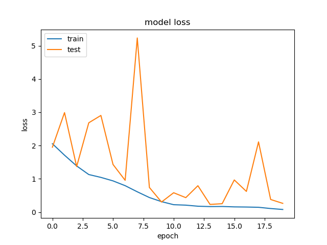

# 数学算式识别(*mathematical expression recognition*)

## 描述
udacity机器学习期末项目，使用深度学习识别一张图片中的算式。在测试集上的正确率为99.6%。
-   输入：一张彩色图片
-   输出：算式的内容

这个项目的意义在于可以识别算式类型的验证码。
## 数据以及观察结果
数据集可以通过这个链接下载：[数据下载链接](https://s3.cn-north-1.amazonaws.com.cn/static-documents/nd009/MLND+Capstone/Mathematical_Expression_Recognition_train.zip)

此数据集包含10万张图片，每张图里面都有一个算式。
-   每个算式可能包含  `+-*`  三种运算符， 可能包含一对括号，可能包含0-9中的几个数字，以及每个算式包含一个等号。所以一共出现的字符总数是16种。
-   每个字符都可能旋转。
-   图片大小统一是300*64。
-   图片字体是各种颜色的，背景也是各种颜色的，但是背景都是浅色（接近白色）
-   图片中有一些噪点。
## 项目基础

**计算机硬件条件**
-   操作系统win10（x64）
-   CPU：InteL Core i5-6500 @ 3.20GHz 四核
-   内存：16 GB
-   显卡	Nvidia GeForce GTX 1060 6GB

**所使用的库**
-   numpy==1.15.4
-   pandas==0.23.4
-   scikit-learn==0.20.1
-   tensorflow==1.10.0
-   keras-gpu==2.2.4
-   opencv==3.4.2
-   matplotlib==3.0.1
## 分析
- plan A（放弃）
查看数据图片后，我开始觉得如果能从算式图中切分出每个字符的图片，然后使用每个字符的图片做识别比较恰当。但是实现切分的过程中，遇见了困难，因为这个切分是只有图片，没有标记的切分位置，所以相当于非监督学习。我使用opencv的findContours来提取轮廓，但是由于被识别字体不是标准的，所以部分字符被切分成好几个部分了。如果切分部分准确率都不高的话，模型最终成果一定不好。
- plan B（采用）
发觉plan A的缺陷后，我觉得换一种思路，直接将算式图输入模型，然后结合CNN和RNN，直接输出。
由于识别的图片大小是300*64，而且这次识别的内容是符号比较简单，我觉得使用一个简单的cnn模型就行，不需要使用resnet或者xception来提取特征。
## 解决方案
- 先将图片转化成灰度图处理.
- 把label（算式）处理成one_hot的形式。

		print(max([len(label) for label in  train_df['label']]))
	
	得到最大长度为11，然后可能出现的字符为17种（加上空），所以吧label转化为11*17的one-hot的形式。

- 取前55000张图片作为训练集（16G内存放太多图片会溢出），5000张图片作为测试集。

- 然后输入一个由CNN和RNN组成的深度模型中，训练40个批次，四个小时左右达到99.6%的正确率
## 模型

## 指标
正确率（Accuracy）= 每个识别正确的字符/字符的总量  

## 图片预处理
先装成灰度图，然后除以255方便模型计算。

## 代码执行过程
- 下载数据集
- 保证环境有相关依赖 
	
		python train.py
## 探索可视化
为了让结果直观，将使用plt绘制，测试集和验证集正确率，以及误差（loss）的曲线。

